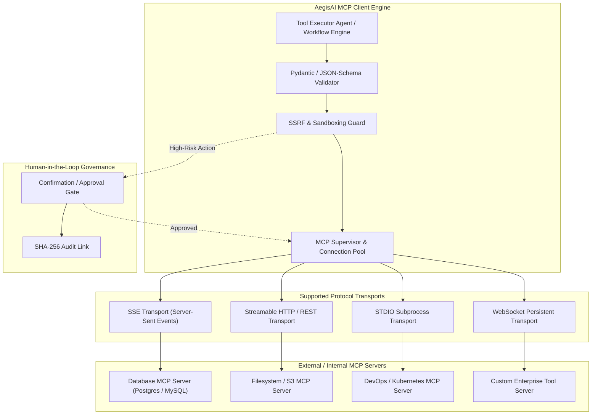

# Model Context Protocol (MCP) Architecture & Tool Execution

## 1. Overview

AegisAI natively implements the **Model Context Protocol (MCP)** specification, transforming LLMs and autonomous agents from static reasoning engines into active platform operators capable of interacting securely with enterprise databases, APIs, file systems, and external services.

---

## 2. Supported Protocol Transports

AegisAI supports 4 MCP transport protocols implemented in `backend/app/services/mcp/`:

| Transport | Implementation Class | Use Case | Lifecycle & Timeout |
| :--- | :--- | :--- | :--- |
| **SSE (Server-Sent Events)** | `MCPSSEClient` | Cloud-hosted MCP servers with streaming event responses. | Persistent HTTP stream, 60s ping timeout. |
| **Streamable HTTP** | `MCPHTTPClient` | Standard REST/JSON-RPC 2.0 endpoints over HTTPS. | Connection pooled via `httpx.AsyncClient`, 30s timeout. |
| **STDIO** | `MCPStdioClient` | Local CLI tools and isolated container utilities. | Subprocess spawned in sandboxed shell, 45s hard process termination. |
| **WebSocket** | `MCPWebSocketClient` | Low-latency, full-duplex bidirectional tool interactions. | Persistent WS connection with heartbeat ping/pong. |

---

## 3. Tool Discovery & Dynamic Registry

1. **Server Registration**:
   - Admins and authorized users register servers with transport configurations, authentication credentials (AES-256 encrypted), and workspace scoping.
2. **Capability Introspection**:
   - On connection, AegisAI issues an `mcp.list_tools` JSON-RPC handshake request.
   - Returned tool definitions, JSON input schemas, and required permissions are parsed and registered in the active **Tool Catalog** (`UserMcpMarket.jsx`, `AdminMcp.jsx`).
3. **Dynamic Invocation**:
   - When the **Tool Executor Agent** or a **Workflow Node** calls a tool, the payload is dynamically validated against the registered schema before dispatch.

---

## 4. Security, Sandboxing & Human Approval Gates

### 4.1 SSRF Mitigation & Private IP Blocking
- Outbound requests from HTTP/SSE/WS transports pass through an IP filter that blocks loopback (`127.0.0.1`, `::1`), link-local (`169.254.0.0/16`), and private RFC 1918 addresses (`10.0.0.0/8`, `172.16.0.0/12`, `192.168.0.0/16`) unless explicitly allowlisted in configuration.

### 4.2 STDIO Process Isolation
- Subprocess arguments are sanitized to prevent command injection (`&&`, `;`, `|`, `` ` ``).
- Commands run with restricted environment variables and without elevated root privileges.

### 4.3 Human-in-the-Loop (HITL) Approval Gating
- MCP tools can be flagged with risk levels (`LOW`, `MEDIUM`, `HIGH`, `CRITICAL`).
- High and Critical tools (e.g., `execute_sql_mutation`, `delete_s3_bucket`) trigger a pause in execution:
  - An interactive approval request is dispatched to the user interface.
  - The tool is executed only after explicit cryptographic confirmation by an authorized team member.

---

## 5. Verification & Test Coverage

The MCP subsystem is verified by **112 backend tests** in `backend/tests/unit/test_mcp_*.py`:
- All 4 transport adapters verified under simulated mock server connections.
- Parameter validation, schema errors, and timeout handling.
- SSRF block filters and sensitive credential masking.
- Human confirmation approval queues and resume flows.
