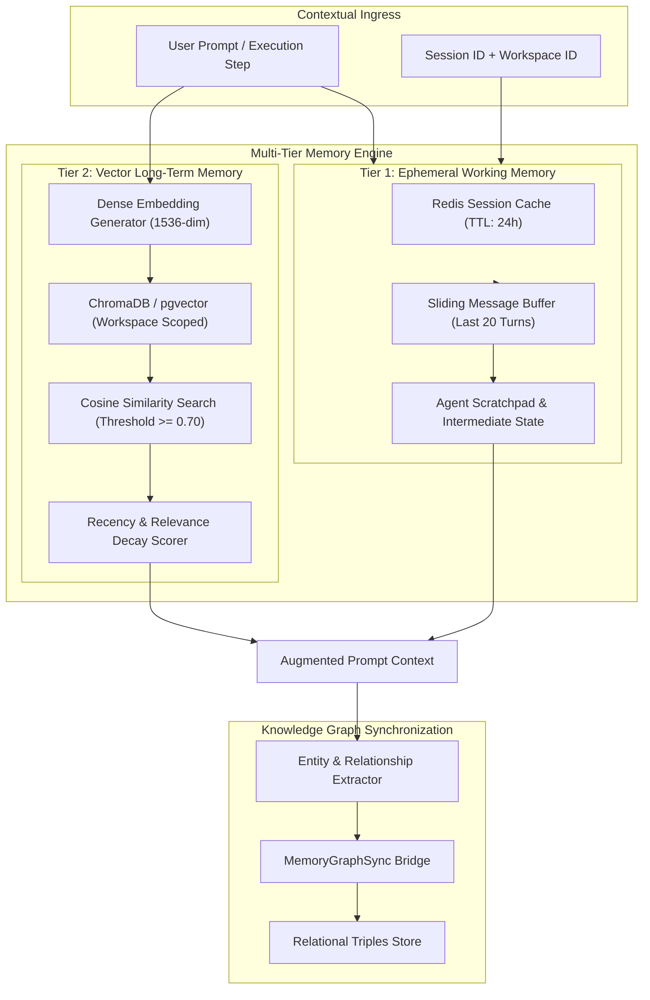

# Memory Architecture & Semantic Retrieval Engine

## 1. Overview

AegisAI features a multi-tiered memory architecture designed to provide both high-speed conversational working context and durable, semantic long-term recall across enterprise sessions. The architecture separates ephemeral session state from persistent vector embeddings, guaranteeing strict tenant isolation and configurable eviction policies.



---

## 2. Memory Tier Breakdown

### 2.1 Tier 1: Ephemeral Working Memory (`app/services/memory/`)
- **Storage Backend**: Redis 7+ and fast in-memory process caches.
- **Scope**: Bound strictly to a single conversational `session_id` and `workspace_id`.
- **Retention & Eviction**:
  - Automatically expires after 24 hours of inactivity (configurable via `MEMORY_SESSION_TTL_SECONDS`).
  - Maintains a sliding message history window (default: last 20 turns) to prevent LLM context window overflow.
- **Agent Scratchpad**: Provides intermediate scratchpad memory for multi-agent deliberations, plan steps, and MCP tool output buffers before synthesis.

### 2.2 Tier 2: Vector Long-Term Memory (`app/services/memory/memory_service.py`)
- **Storage Backend**: ChromaDB / `pgvector` with persistent disk storage.
- **Representation**: 1536-dimensional dense vector embeddings generated via OpenAI text-embedding-3-small or compatible local embedding models.
- **Metadata Tagging**: Every stored memory unit contains:
  ```json
  {
    "memory_id": "mem_01h8v92...",
    "workspace_id": "ws_enterprise_alpha",
    "user_id": "usr_99812",
    "content": "User prefers concise executive summaries in tabular format.",
    "category": "preference",
    "confidence": 0.95,
    "created_at": "2026-09-15T10:30:00Z",
    "last_accessed_at": "2026-10-01T08:15:00Z",
    "access_count": 14
  }
  ```
- **Similarity & Relevance Scoring**:
  Memory retrieval calculates a composite relevance score combining cosine similarity and time decay:
  $$\text{Relevance} = \alpha \cdot \text{CosineSimilarity}(\vec{q}, \vec{m}) + (1 - \alpha) \cdot e^{-\lambda \Delta t}$$
  - $\vec{q}$: Query vector
  - $\vec{m}$: Memory embedding
  - $\Delta t$: Elapsed time since creation / last access
  - $\alpha$: Weighting factor (default: `0.75`)
  - $\lambda$: Half-life decay constant

### 2.3 Tier 3: Memory-Graph Synchronization (`MemoryGraphSync`)
When key facts, user preferences, or system entities are committed to long-term memory:
1. The **Entity Extractor** identifies structured entities and relationships (e.g., `(User, prefers, Tabular_Format)`).
2. The `MemoryGraphSync` pipeline automatically writes the extracted triples to the **Knowledge Graph**, ensuring that unstructured vector memory and structured relational knowledge remain synchronized.

---

## 3. Privacy, Isolation & Tenant Boundary Enforcement

1. **Workspace Hard Boundaries**: All vector similarity queries enforce hard metadata filtering:
   ```python
   results = vector_collection.query(
       query_embeddings=[query_vector],
       n_results=top_k,
       where={"workspace_id": authenticated_workspace_id}
   )
   ```
2. **User vs Workspace Memory Visibility**:
   - `workspace` scope: Shared enterprise knowledge accessible to all authorized workspace members.
   - `user` scope: Private preferences and personal interaction history accessible only to the originating user.
3. **Explicit Eviction & Deletion**:
   - Users can search, inspect, export, or permanently delete individual memory records or entire session histories via the Memory Vault UI (`/user/memory`) or REST API (`DELETE /api/v1/memory/{memory_id}`).

---

## 4. Verification & Performance Baseline

- **Unit & Integration Tests**: 82 test cases verifying vector recall accuracy, metadata filtering, memory decay scoring, and eviction policies in `backend/tests/unit/test_memory_*.py`.
- **Search Latency**: Sub-15ms vector retrieval across 100,000 embedded records with local indexed storage.
