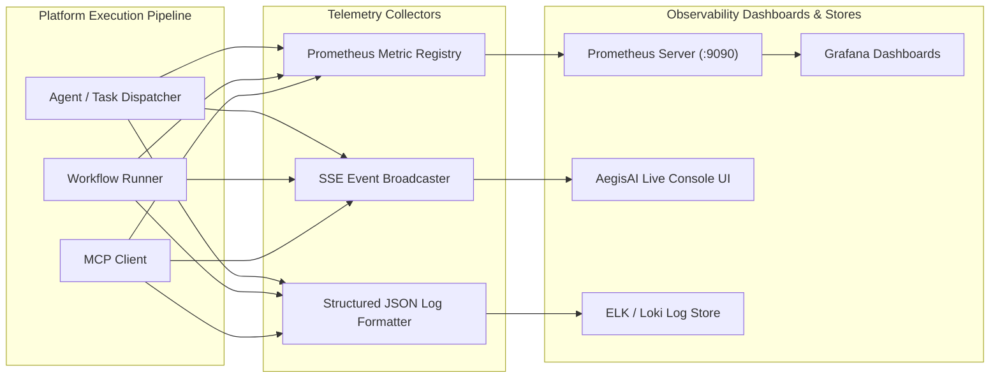

# Observability, Metrics & Execution Telemetry

## 1. Overview

AegisAI provides deep observability across multi-agent executions, workflow node transitions, vector retrievals, and external tool calls through structured JSON logs, Prometheus metric counters, and Server-Sent Events (SSE).



---

## 2. Core Prometheus Metrics

Exported via `GET /api/v1/metrics`:

| Metric Name | Type | Description | Labels |
| :--- | :--- | :--- | :--- |
| `aegisai_agent_executions_total` | Counter | Total number of agent subtasks executed. | `agent_name`, `status`, `workspace_id` |
| `aegisai_agent_execution_duration_seconds` | Histogram | Latency distribution of agent execution steps. | `agent_name`, `status` |
| `aegisai_mcp_tool_calls_total` | Counter | Total invocations of external MCP tools. | `tool_name`, `transport`, `status` |
| `aegisai_rag_retrievals_total` | Counter | Total vector searches and chunk retrievals. | `document_id`, `status` |
| `aegisai_rag_retrieval_latency_seconds` | Histogram | Search latency across dense vector indices. | `workspace_id` |
| `aegisai_workflow_executions_total` | Counter | Number of DAG workflow executions. | `workflow_id`, `status` |
| `aegisai_active_sessions_gauge` | Gauge | Current count of active user and agent sessions. | `workspace_id` |

---

## 3. Structured JSON Logging

Logs are emitted to `stdout` in structured JSON format with contextual trace identifiers:

```json
{
  "timestamp": "2026-10-06T09:45:12.314Z",
  "level": "INFO",
  "logger": "app.core.platform.intelligence.engine",
  "trace_id": "trc_90184b9a8f",
  "workspace_id": "ws_enterprise_alpha",
  "user_id": "usr_99812",
  "event": "agent_subtask_completed",
  "agent": "Enterprise RAG Agent",
  "duration_ms": 142.6,
  "chunks_retrieved": 3,
  "critic_factuality_score": 0.98
}
```

---

## 4. Real-Time Execution SSE Stream Protocol

Clients subscribe to live execution updates via `GET /api/v1/platform/stream/{session_id}` or `POST /api/v1/platform/execute`:

```
event: step_started
data: {"step": "PLANNER", "status": "RUNNING", "timestamp": 1728207912}

event: step_progress
data: {"step": "RAG_SEARCH", "progress_pct": 50, "detail": "Queried 3 document embeddings"}

event: step_completed
data: {"step": "CRITIC", "factuality_score": 0.98, "status": "VERIFIED"}

event: completed
data: {"final_answer": "...", "citations": [...], "duration_seconds": 1.45}
```
