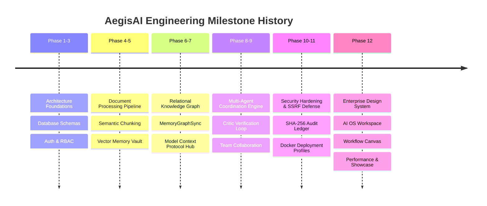

# AegisAI — Engineering Roadmap & Project Timeline

This document summarizes the chronological development trajectory of **AegisAI** from architectural foundations through final product readiness.

---

---

## 📅 Detailed Phase Breakdown

### Phases 1–3: Core Foundation & Security Boundaries
- Initialized FastAPI asynchronous backend with SQLAlchemy 2.0 and Alembic migrations.
- Established JWT authentication, cryptographically secure refresh token rotation, and dual-tier RBAC (`super_admin`, `admin`, `user`).
- Enforced strict multi-tenant isolation parameterized by `workspace_id`.

### Phases 4–5: Enterprise Document Ingestion & Contextual Memory Vault
- Developed multi-format document parser (PDF, DOCX, TXT, MD) using `pypdf` and `python-docx`.
- Implemented sliding-window semantic chunking (500 chars, 100 char overlap) and 1536-dimensional vector embedding storage.
- Engineered dual-tier memory system combining Redis ephemeral session buffers with vector long-term semantic recall and exponential time-decay scoring.

### Phases 6–7: Relational Knowledge Graph & Model Context Protocol (MCP)
- Implemented Knowledge Graph triple store (`subject, predicate, object`) with Breadth-First Search (BFS) shortest-path pathfinding.
- Created `MemoryGraphSync` bridge to automatically synchronize memorized facts into graph triples.
- Built unified MCP client supporting 4 protocol transports (SSE, Streamable HTTP, STDIO, WS) with SSRF defense and Human-in-the-Loop (HITL) approval gates.

### Phases 8–9: Multi-Agent Coordination Engine & Team Collaboration
- Designed canonical 9-agent state machine (Orchestrator, Planner, RAG, Graph, Memory, Tool Executor, Critic, Synthesizer).
- Implemented Critic Agent automated hallucination verification and replanning loops.
- Added multi-user team workspaces with fine-grained team roles (`owner`, `maintainer`, `editor`, `viewer`) and WebSocket activity broadcasts.

### Phases 10–11: Enterprise Security Hardening & Production Deployment
- Implemented append-only SHA-256 tamper-evident cryptographic audit ledger with verification endpoints.
- Tightened SSRF filters, path traversal bounds, and automated regex secret redaction.
- Packaged multi-stage Dockerfiles and Docker Compose profiles for Development, Staging, and Production with Nginx TLS 1.3 reverse proxy and health probes.

### Phase 12: Comprehensive Product Polish, Performance & Showcase (12.1 – 12.13)
- **12.1–12.9**: Enterprise Design System, Intelligence Factory, AI OS Workspace, Agent Center, Memory Vault, MCP Hub, Visual Workflow Studio, Knowledge Center, and Governance Console.
- **12.10**: Performance & Accessibility audit, dynamic chunk splitting reducing entry JS by 93.2% (100.20 kB), and WCAG-oriented keyboard focus trapping.
- **12.11**: Interactive Demo Showcase mode (`/showcase`) featuring 6 scripted enterprise scenarios with speed controls and non-dismissible demo banners.
- **12.12–12.13**: Definitive engineering knowledge package, academic final-year project report, viva guide, and interview readiness documentation.
