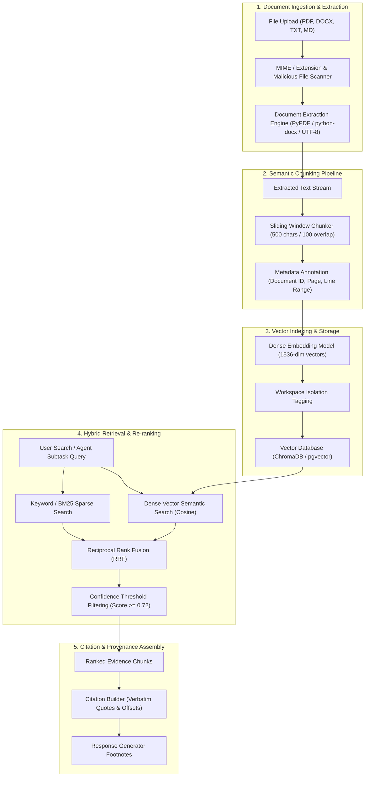

# Enterprise RAG Architecture & Ingestion Pipeline

## 1. Overview

AegisAI's Enterprise Retrieval-Augmented Generation (RAG) subsystem converts raw enterprise documents into high-precision, searchable knowledge chunks. The architecture features an asynchronous multi-format document parser, semantic sliding-window chunker, dense vector indexer, hybrid search retrieval engine, and a citation provenance tracker.



---

## 2. Ingestion & Processing Pipeline (`backend/app/services/document_processing.py`)

### 2.1 Supported File Types & Extraction Engines
- **PDF (`.pdf`)**: Extracted via `pypdf` with page-by-page text extraction, layout preservation, and metadata extraction (author, creation date, total pages).
- **Microsoft Word (`.docx`)**: Extracted via `python-docx` preserving paragraph headings, bullet points, and tables.
- **Markdown & Plain Text (`.md`, `.txt`)**: Direct UTF-8 decoding with markdown header hierarchy parsing.

### 2.2 Semantic Sliding Window Chunking
To preserve context across sentence boundaries:
- **Chunk Size**: 500 characters (configurable via `RAG_CHUNK_SIZE`).
- **Overlap**: 100 characters (configurable via `RAG_CHUNK_OVERLAP`).
- **Boundary Snapping**: Chunks snap to sentence terminators (`.`, `?`, `!`, `\n\n`) to prevent mid-sentence cuts.
- **Metadata Annotation**:
  Each chunk is tagged with its origin:
  ```json
  {
    "chunk_id": "chk_98124_004",
    "document_id": "doc_sec_audit_2026",
    "workspace_id": "ws_enterprise_alpha",
    "page_number": 4,
    "char_start": 1500,
    "char_end": 2000,
    "content": "All external API keys stored within AegisAI are encrypted at rest using AES-256-GCM..."
  }
  ```

---

## 3. Hybrid Retrieval & Provenance Tracking

### 3.1 Hybrid Search Fusion
Queries dispatched by the Enterprise RAG Agent execute a two-stage hybrid search:
1. **Dense Vector Search**: Semantic similarity in embedding space for conceptual match.
2. **Sparse Lexical Search**: Keyword matching for exact acronyms, error codes, and technical identifiers.
3. **Reciprocal Rank Fusion (RRF)**:
   $$\text{Score}_{\text{RRF}}(d) = \sum_{m \in \{\text{dense}, \text{sparse}\}} \frac{1}{k + \text{rank}_m(d)}$$
   where $k = 60$ is the smoothing constant.

### 3.2 Citation & Evidence Provenance
When the Critic Agent and Response Synthesizer construct answers:
- Evidence chunks are attached as structured `provenance` metadata.
- In the frontend UI (`UserPlatform.jsx`, `UserDocuments.jsx`), users can click any citation footnote chip to open the **Evidence Drawer**, displaying the exact excerpt, source document name, confidence score, and page number.

---

## 4. Security, Quotas & Tenant Isolation

1. **File Upload Sanity**:
   - Max file size: 50MB per file.
   - Max documents per workspace: Configurable tier quota (default: 500 documents).
   - Filename sanitization against directory traversal (`../` removal).
2. **Vector Space Partitioning**:
   - Vector collections are scoped strictly to individual workspaces.
   - Queries from Workspace A cannot retrieve chunks belonging to Workspace B under any circumstance.

---

## 5. Verification & Test Suite

The Enterprise RAG pipeline is validated by **94 backend test cases** covering:
- Document upload and extraction (`tests/unit/test_document_processing.py`)
- Chunking edge cases, empty documents, and unicode handling (`tests/unit/test_chunking_embeddings.py`)
- RAG search filtering and citation assembly (`tests/unit/test_rag_service.py`)
