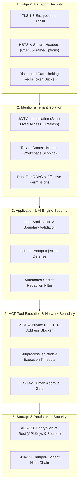

# Security Architecture & Zero-Trust Defense in Depth

## 1. Security Principles

AegisAI is engineered around the principle of **Defense in Depth** and **Zero-Trust Access Control**:
- **Never Trust, Always Verify**: Every incoming API request, MCP tool dispatch, and agent message is validated against active cryptographic claims.
- **Strict Multi-Tenancy**: Data segregation by `workspace_id` is enforced at the database, vector store, graph engine, and caching layers.
- **Least Privilege**: Users and service accounts operate with the minimal set of permissions required for their assigned roles.
- **Immutable Provenance**: High-risk mutations and administrative actions are permanently recorded in a tamper-evident SHA-256 hash ledger.

---

## 2. Authentication & Session Management (`backend/app/core/auth.py`)

### 2.1 JWT Access Tokens
- Signed with HMAC-SHA256 (`HS256`).
- Expiration: 30 minutes (configurable via `ACCESS_TOKEN_EXPIRE_MINUTES`).
- Contains immutable user identity claims: `sub` (user_id), `workspace_id`, `role`, `exp`, `iat`.

### 2.2 Cryptographic Refresh Tokens
- Cryptographically secure 256-bit random strings stored hashed in the PostgreSQL database.
- Expiration: 7 days.
- Invalidation: Logging out or changing passwords immediately revokes all associated active refresh tokens.

---

## 3. Server-Side Request Forgery (SSRF) Defense for MCP

External MCP server connections (`backend/app/services/mcp/`) are protected against SSRF:
- **DNS Resolution Check**: Target hostnames are resolved to IP addresses before initiating HTTP or WebSocket connections.
- **Prohibited IP Ranges**:
  - `127.0.0.0/8` (Loopback)
  - `10.0.0.0/8`, `172.16.0.0/12`, `192.168.0.0/16` (RFC 1918 Private Networks)
  - `169.254.0.0/16` (Link-Local / AWS Cloud Metadata)
  - `::1` and IPv6 link-local addresses
- Attempted requests to internal infrastructure are immediately blocked and logged as security violations.

---

## 4. Prompt Injection & AI Safety Guardrails

- **System Prompt Pinning**: Core agent system prompts are immutable and sealed within backend code, preventing user overrides from compromising core behavioral constraints.
- **Delimiter Isolation**: Untrusted context retrieved from third-party documents and MCP tools is wrapped in strict XML delimiters (`<untrusted_document_context>...</untrusted_document_context>`) instructing the LLM to treat content strictly as reference data rather than executable instructions.
- **Critic Agent Verification**: Intermediate generation outputs are reviewed by the Critic Agent to ensure responses adhere to verified source citations.

---

## 5. Secret Encryption & Redaction

- **Secrets at Rest**: Third-party API keys (OpenAI, Anthropic, custom MCP servers) are encrypted in PostgreSQL using **AES-256-GCM** with unique per-record initialization vectors (IVs).
- **Automated Redaction**: All API responses, execution logs, and audit entries pass through regex masks redacting high-entropy strings and token signatures (`Bearer *`, `sk-*`, `ghp_*`).
