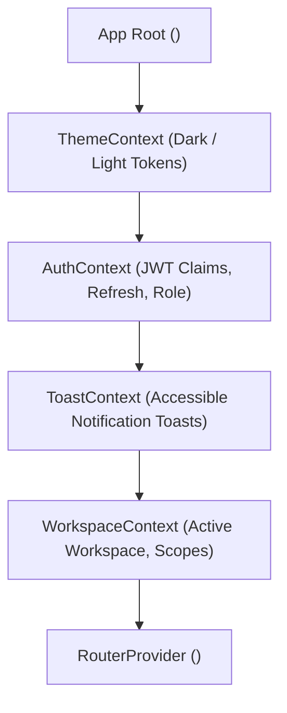

# Frontend UI Module & Component Architecture Map

## 1. Overview

The AegisAI frontend is an enterprise Single Page Application (SPA) built on **React 19**, **React Router v7**, **Tailwind CSS v4**, and **@xyflow/react**. This document maps routes, components, contexts, and design system tokens.

---

## 2. Route & View Mapping

| Route Path | View Component File | Purpose | Lazy Chunk Name |
| :--- | :--- | :--- | :--- |
| `/` | `pages/LandingPage.jsx` | Intelligence Factory landing tour & public product introduction | `index.js` |
| `/showcase` | `pages/ShowcasePage.jsx` | 6-scenario interactive enterprise demo simulation tour | `ShowcasePage-*.js` |
| `/login`, `/register` | `pages/Login.jsx`, `pages/Register.jsx` | Authentication ingress with token persistence | `index.js` |
| `/user/platform` | `pages/UserPlatform.jsx` | Multi-agent AI OS workspace with live SSE execution stream | `UserPlatform-*.js` |
| `/user/agents` | `pages/UserAiMarket.jsx` | Agent center, 9-agent catalog, comparison drawer, DAG view | `UserAiMarket-*.js` |
| `/user/memory` | `pages/UserMemory.jsx` | Memory Vault, vector memory inspector, session buffers | `UserMemory-*.js` |
| `/user/mcp` | `pages/UserMcpMarket.jsx` | MCP tool center, schema viewer, test execution drawer | `UserMcpMarket-*.js` |
| `/user/workflows` | `pages/UserWorkflows.jsx` | Visual AI automation studio directory, schedules & approvals | `UserWorkflows-*.js` |
| `/user/workflows/:id`| `pages/UserWorkflowEditor.jsx` | Drag-and-drop ReactFlow visual workflow DAG canvas | `UserWorkflowEditor-*.js`|
| `/user/documents` | `pages/UserDocuments.jsx` | Enterprise RAG document center, file upload & chunk viewer | `UserDocuments-*.js` |
| `/user/graph` | `pages/UserGraph.jsx` | 2D force-directed knowledge graph, BFS pathfinder, triples | `UserGraph-*.js` |
| `/admin/governance`| `pages/AdminSecurity.jsx` | SHA-256 audit ledger, chain verification, security posture | `AdminSecurity-*.js` |
| `/admin/users` | `pages/AdminUsers.jsx` | User management, RBAC assignments, team roles | `AdminUsers-*.js` |
| `/admin/analytics` | `pages/AdminAnalytics.jsx` | Cluster metrics, execution throughput, agent efficiency | `AdminAnalytics-*.js` |

---

## 3. Global Context Providers (`frontend/src/contexts/`)

- **`ThemeContext`**: Manages dynamic theme state (`theme-dark` / `theme-light`), persists in `localStorage`, and updates root CSS variables.
- **`AuthContext`**: Handles token decoding, silent refresh on 401, session timeouts, and role checks.
- **`ToastContext`**: Emits accessible screen-reader polite/assertive toast notifications.
- **`WorkspaceContext`**: Maintains current active tenant workspace ID and available user permissions.

---

## 4. Design System Tokens & Primitives (`frontend/src/components/ui/`)

| Primitive Component | Location | Variants & Capabilities |
| :--- | :--- | :--- |
| **`Badge`** | `components/ui/Badge.jsx` | `primary`, `success`, `warning`, `danger`, `neutral`, `info`. |
| **`Button`** | `components/ui/Button.jsx` | `primary`, `secondary`, `outline`, `ghost`, `danger`, `sm`/`md`/`lg`. |
| **`Drawer`** | `components/ui/Drawer.jsx` | Focus-trapping slide-over sheet with accessible ARIA labels. |
| **`Modal`** | `components/ui/Modal.jsx` | Keyboard-trapped dialog with backdrop dismiss and escape key handler. |
| **`Tabs`** | `components/ui/Tabs.jsx` | Keyboard-navigable accessible tab list with arrow key switching. |
| **`DemoBanner`** | `components/ui/DemoBanner.jsx` | Persistent, non-dismissible amber demo indicator bar. |
