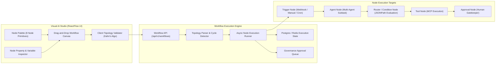
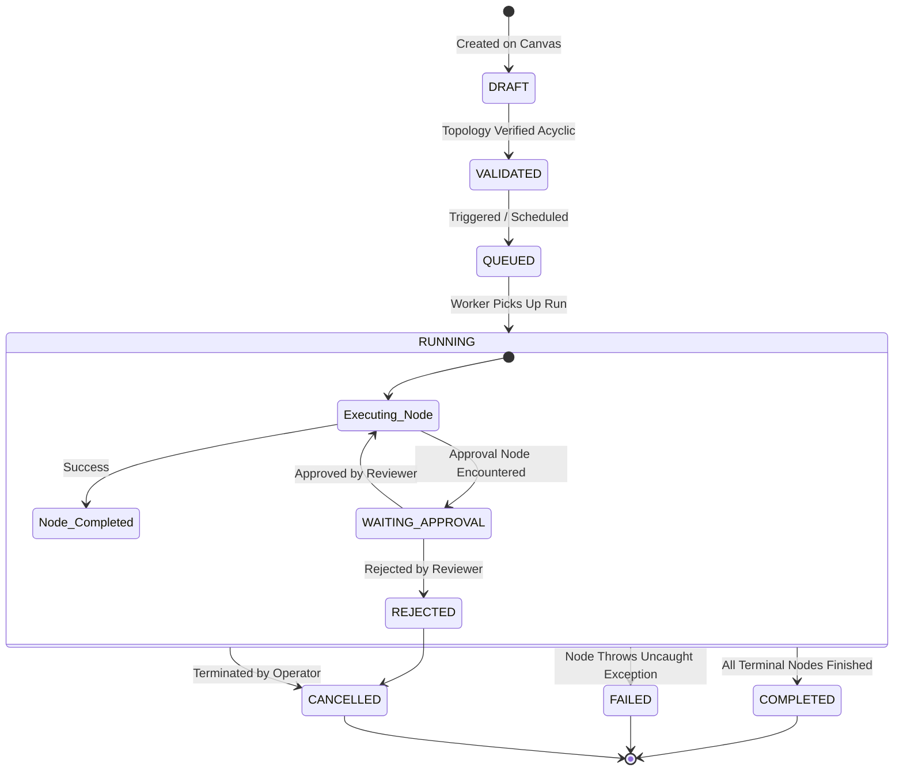

# Visual AI Workflow Automation Architecture

## 1. Overview

AegisAI provides an enterprise-grade visual workflow automation engine that allows users and systems to construct, execute, and monitor Directed Acyclic Graphs (DAGs) of AI agents, MCP tools, conditional routers, human approvals, and data transformations.

---

## 2. Supported Node Types & Semantics

| Node Type | Category | Functionality | Execution Behavior |
| :--- | :--- | :--- | :--- |
| **`trigger`** | Ingress | Initiates workflow via manual dispatch, scheduled cron, or inbound webhook. | Emits initial execution payload and timestamp. |
| **`agent`** | AI Compute | Invokes one of the 9 specialized agents with custom system prompt overrides. | Asynchronously dispatches subtask and awaits structured response. |
| **`mcp_tool`** | Integration | Calls a registered MCP tool over SSE, HTTP, STDIO, or WebSocket. | Validates arguments against schema and captures output artifact. |
| **`condition`** | Control Flow | Evaluates boolean expressions (e.g., `payload.confidence > 0.85`). | Directs downstream flow along `true` or `false` edge handles. |
| **`router`** | Control Flow | Multi-branch routing matching specific string or numeric cases. | Directs downstream flow along the first matching named branch. |
| **`transform`** | Data | Performs JSON transformations, mapping, regex extraction, or filtering. | Executes safe expression transformation without external side-effects. |
| **`approval`** | Governance | Pauses execution awaiting human confirmation. | Sets status to `WAITING_FOR_APPROVAL` until signed by an authorized user. |
| **`webhook`** | Egress | Emits HTTP POST webhook payload to external enterprise endpoint. | Dispatches webhook with retry backoff (up to 3 retries). |

---

## 3. Execution State Machine & Lifecycle

Every workflow run progresses through strict lifecycle states:

---

## 4. Graph Validation, Variable Scoping & Versioning

### 4.1 Topology Validation & Cycle Detection
- Workflows are validated both client-side and server-side using **Kahn's Algorithm for Topological Sorting**.
- If a circular edge or unreachable orphan node is detected, validation errors are emitted and execution is blocked.

### 4.2 Variable Scoping & Context Passing
- Workflows support scoped execution variables (e.g., `{{global.company_name}}`, `{{node_1.output.summary}}`).
- The execution context is immutably passed from parent nodes to child edges, preventing race conditions during parallel branching.

### 4.3 Atomic Versioning & Safe Rollback
- Workflow definitions support semantic versioning (`v1`, `v2`, `v3`).
- Editing an active workflow creates a new version draft; in-flight executions continue executing against the exact snapshot version with which they were initiated.

---

## 5. Verification & Test Suite

The visual workflow engine is verified by **128 backend unit tests** in `backend/tests/unit/test_workflow_*.py` and **13 frontend vitest tests** in `frontend/src/__tests__/workflow_builder.test.jsx`.
