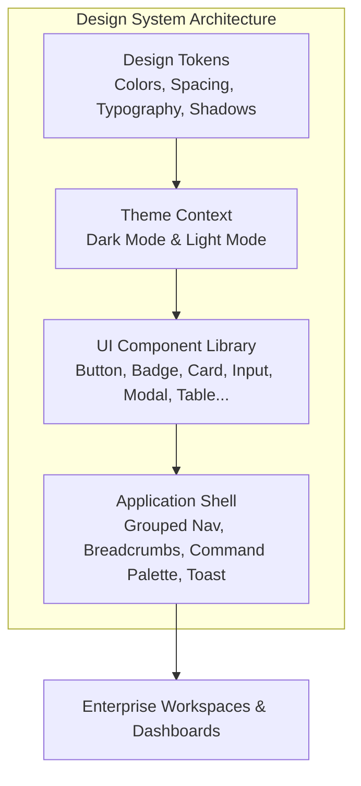

# AegisAI Enterprise — Frontend Design System Specification

## 1. Design Philosophy & Product Direction

AegisAI is engineered as an **Enterprise AI Operating System & Mission Control Platform**. The visual direction embodies:

- **Sophisticated & Technical**: Clean lines, high information density without visual clutter, precise typography, and subtle technical indicators.
- **Enterprise Restraint**: Replaces garish gradients and playful SaaS animations with functional data density, intentional status indicators, and crisp contrast.
- **Accessible & Responsive**: Full keyboard navigation support, WCAG AA contrast compliance, dark and light theme adaptability, and smooth degradation across mobile, tablet, and desktop viewports.

---

## 2. Color System & Theme Tokens

The design system is structured around semantic CSS custom properties supporting seamless Dark (default) and Light theme switching:

### Dark Theme (Default)
- **Background (`--bg-app`)**: `#07080a` (Deep Void)
- **Surface (`--bg-surface`)**: `#0d1017` (Slate Black, 75% opacity with 12px blur)
- **Elevated Surface (`--bg-surface-elevated`)**: `#161b22`
- **Text Primary (`--text-primary`)**: `#f1f3f9`
- **Text Secondary (`--text-secondary`)**: `#8e9bb3`
- **Text Muted (`--text-muted`)**: `#57657d`
- **Border Subtle (`--border-subtle`)**: `rgba(255, 255, 255, 0.08)`
- **Border Active / Focus (`--border-active`)**: `rgba(0, 240, 255, 0.3)`

### Light Theme
- **Background (`--bg-app`)**: `#f8fafc` (Clean Slate)
- **Surface (`--bg-surface`)**: `#ffffff` (Pure White)
- **Elevated Surface (`--bg-surface-elevated`)**: `#f1f5f9`
- **Text Primary (`--text-primary`)**: `#0f172a`
- **Text Secondary (`--text-secondary`)**: `#475569`
- **Text Muted (`--text-muted`)**: `#94a3b8`
- **Border Subtle (`--border-subtle`)**: `rgba(0, 0, 0, 0.08)`
- **Border Active / Focus (`--border-active`)**: `rgba(6, 182, 212, 0.4)`

---

## 3. Typography Hierarchy

The platform standardizes on **Outfit** for clean display/body text and **JetBrains Mono** for technical telemetry, code snippets, execution IDs, and status badges.

| Category | Size | Weight | Line Height | Tracking | Font Family | Usage |
| :--- | :--- | :--- | :--- | :--- | :--- | :--- |
| **Display** | 32px / 2rem | Bold (700) | 1.2 | -0.02em | Outfit | Hero titles, landing page headers |
| **Heading 1** | 24px / 1.5rem | SemiBold (600) | 1.25 | -0.01em | Outfit | Page headers, primary view titles |
| **Heading 2** | 18px / 1.125rem| SemiBold (600) | 1.3 | 0 | Outfit | Section headers, modal titles |
| **Heading 3** | 14px / 0.875rem| SemiBold (600) | 1.4 | 0.01em | Outfit | Card titles, panel headers |
| **Body** | 14px / 0.875rem| Regular (400) | 1.5 | 0 | Outfit | Standard paragraphs, content text |
| **Caption** | 12px / 0.75rem | Medium (500) | 1.4 | 0.01em | Outfit | Helper text, secondary descriptions |
| **Code / Mono** | 12px / 0.75rem | Regular (400) | 1.5 | 0 | JetBrains Mono | Logs, JSON payloads, execution IDs |
| **Status Metric**| 11px / 0.687rem| SemiBold (600) | 1.0 | 0.05em | JetBrains Mono | StatusBadge, pill tags, breadcrumbs |

---

## 4. Status Vocabulary & Semantic Colors

AegisAI employs a unified status taxonomy across all UI screens to eliminate inconsistent ad-hoc colors:

| Status Group | Values | Visual Treatment | Meaning / Lifecycle Phase |
| :--- | :--- | :--- | :--- |
| **Success / Completed** | `COMPLETED`, `SUCCEEDED`, `ONLINE`, `SAFE`, `ACTIVE` | Emerald (Green) Border + Subtle Background | Milestone passed with 100% verification |
| **In-Flight / Active** | `EXECUTING`, `RUNNING`, `CLAIMED`, `PLANNING`, `VERIFYING` | Cyan Border + Pulsing Indicator | Multi-step agent or worker actively processing |
| **Queued / Staged** | `REQUESTED`, `QUEUED`, `PENDING`, `RETRY_WAIT`, `DRAFT` | Amber Border + Static Dot | Waiting for worker claim or scheduler evaluation |
| **Degraded / Warning**| `DEGRADED`, `WARNING` | Yellow Border + Pulsing Indicator | Subsystem functioning with partial failures |
| **Error / Critical** | `FAILED`, `DEAD_LETTERED`, `OFFLINE`, `BLOCKED`, `CRITICAL` | Rose (Red) Border + Solid Indicator | Irrecoverable failure or security policy violation |
| **Neutral / Archived**| `CANCELLED`, `INACTIVE`, `ARCHIVED`, `UNKNOWN` | Slate Border + Muted Indicator | Stopped by operator or out of active scope |

---

## 5. Standardized Core Components

All UI components reside in `frontend/src/components/ui/` with consistent props, accessibility attributes, and responsive adaptations:

- **[`Button.jsx`](file:///d:/CP/AegisAI/frontend/src/components/ui/Button.jsx)**: Variants (`primary`, `secondary`, `ghost`, `outline`, `danger`, `success`), sizes (`xs`, `sm`, `md`, `lg`), loading spinner with disabled state.
- **[`IconButton.jsx`](file:///d:/CP/AegisAI/frontend/src/components/ui/IconButton.jsx)**: Mandatory `aria-label`, tooltip integration, compact sizing.
- **[`StatusBadge.jsx`](file:///d:/CP/AegisAI/frontend/src/components/ui/StatusBadge.jsx)**: Normalizes status strings into verified color palettes with monospace font.
- **[`Card.jsx`](file:///d:/CP/AegisAI/frontend/src/components/ui/Card.jsx) & [`MetricCard.jsx`](file:///d:/CP/AegisAI/frontend/src/components/ui/MetricCard.jsx)**: Structured cards with KPI trend directions (`up`, `down`, `neutral`).
- **[`Input.jsx`](file:///d:/CP/AegisAI/frontend/src/components/ui/Input.jsx), [`Textarea.jsx`](file:///d:/CP/AegisAI/frontend/src/components/ui/Input.jsx), [`Select.jsx`](file:///d:/CP/AegisAI/frontend/src/components/ui/Input.jsx)**: Accessible form controls with validation feedback.
- **[`Modal.jsx`](file:///d:/CP/AegisAI/frontend/src/components/ui/Modal.jsx) & [`ConfirmDialog.jsx`](file:///d:/CP/AegisAI/frontend/src/components/ui/Modal.jsx)**: Accessible dialogs with focus trap, ESC listener, backdrop blur, and destructive action gating.
- **[`Table.jsx`](file:///d:/CP/AegisAI/frontend/src/components/ui/Table.jsx) & [`Pagination.jsx`](file:///d:/CP/AegisAI/frontend/src/components/ui/Table.jsx)**: Responsive enterprise data table with sortable headers and pagination controls.
- **[`EmptyState.jsx`](file:///d:/CP/AegisAI/frontend/src/components/ui/EmptyState.jsx)**: Explanatory empty states with primary and secondary call-to-action buttons.
- **[`Skeleton.jsx`](file:///d:/CP/AegisAI/frontend/src/components/ui/Skeleton.jsx) & [`Spinner.jsx`](file:///d:/CP/AegisAI/frontend/src/components/ui/Skeleton.jsx)**: Progressive loading state skeletons avoiding raw "Loading..." placeholders.
- **[`Timeline.jsx`](file:///d:/CP/AegisAI/frontend/src/components/ui/Timeline.jsx)**: Execution milestone visualizer for multi-agent reasoning.

---

## 6. Global Command Palette & Navigation

- **Trigger**: `Ctrl + K` (or `Cmd + K` on macOS).
- **Features**: Global fuzzy search across AI Workspaces, Workflow Builder, Documents Hub, Memory Vault, Knowledge Graph, MCP Marketplace, Team Management, Theme Toggling, and Session Lock.
- **RBAC Gating**: Filters commands according to active authenticated user role (`user`, `admin`, `super admin`).

---

## 7. Accessibility (a11y) & Motion Standards

- **Keyboard Navigation**: All interactive elements (buttons, inputs, tabs, modals, switches) are navigable via Tab, Space, Enter, and Arrow keys.
- **Visible Focus Rings**: Standardized `focus-visible:ring-2 focus-visible:ring-cyan-500/50`.
- **Reduced Motion**: Respects `prefers-reduced-motion: reduce` by setting animation durations to 0.01ms.
- **Live Regions**: Toast notifications use `aria-live="polite"` and `role="alert"`.
