# Phase 12 — Final Product Polish & Enterprise Experience Master Summary

## 1. Executive Summary

Phase 12 transformed **AegisAI** from a feature-complete backend into a world-class, enterprise-grade AI Operating System with a cohesive design system, unified workspace, specialized agent catalog, persistent memory vault, MCP tool hub, visual workflow builder, knowledge intelligence center, governance console, optimized accessibility/performance, scripted demo showcase, and exhaustive technical documentation.

```
==================================================================================
PHASE 12 COMPLETION STATUS: 100% COMPLETE (MILESTONES 12.1 THROUGH 12.12)
- All 12 Sub-Phases Delivered & Verified
- Total Test Suite: 1,178 Verified Passing Tests (955 Backend + 223 Frontend)
- Production Build: 2,572 modules transformed cleanly in ~1.34s (0 errors)
- Primary Entry Bundle: 100.20 kB (23.14 kB gzip) — 93.2% size reduction
==================================================================================
```

---

## 2. Milestone-by-Milestone Summary

```mermaid
flowchart LR
    M1["12.1 Design System"] --> M2["12.2 Intelligence Factory"]
    M2 --> M3["12.3 AI OS Workspace"]
    M3 --> M4["12.4 Agent Center"]
    M4 --> M5["12.5 Memory Vault"]
    M5 --> M6["12.6 MCP Center"]
    M6 --> M7["12.7 Workflow Studio"]
    M7 --> M8["12.8 Knowledge Center"]
    M8 --> M9["12.9 Governance Center"]
    M9 --> M10["12.10 Perf & A11y"]
    M10 --> M11["12.11 Demo Showcase"]
    M11 --> M12["12.12 Engineering Docs"]
```



### Phase 12.1 — Enterprise Design System
- **Key Deliverables**: Unified CSS variables, dark/light theme tokens, typography scale, standard button/badge/drawer/modal components.
- **Reference**: [DESIGN-SYSTEM.md](file:///D:/CP/AegisAI/frontend/docs/DESIGN-SYSTEM.md), [PHASE-12.1-COMPLETE.md](file:///D:/CP/AegisAI/frontend/docs/PHASE-12.1-COMPLETE.md).

### Phase 12.2 — Intelligence Factory & Landing Experience
- **Key Deliverables**: Interactive hero station tour, architectural flowcharts, enterprise capability highlights, and authentication navigation.
- **Reference**: [PHASE-12.2-INTELLIGENCE-FACTORY.md](file:///D:/CP/AegisAI/frontend/docs/PHASE-12.2-INTELLIGENCE-FACTORY.md).

### Phase 12.3 — AI OS Workspace
- **Key Deliverables**: Centralized conversational execution console, real-time multi-agent status strips, plan inspector drawer, verbatim citation drawer, and SSE stream decoder.
- **Reference**: [PHASE-12.3-AI-OS-WORKSPACE.md](file:///D:/CP/AegisAI/frontend/docs/PHASE-12.3-AI-OS-WORKSPACE.md).

### Phase 12.4 — Agent Center & Workforce Catalog
- **Key Deliverables**: 9-agent catalog with category filters, detailed agent inspection drawer, topological DAG coordination flow, and side-by-side agent comparison drawer.
- **Reference**: [PHASE-12.4-AGENT-CENTER.md](file:///D:/CP/AegisAI/frontend/docs/PHASE-12.4-AGENT-CENTER.md).

### Phase 12.5 — Memory Vault
- **Key Deliverables**: Ephemeral working memory buffer viewer, vector long-term memory inspector with similarity thresholds, and memory-graph synchronization indicator.
- **Reference**: [PHASE-12.5-MEMORY-VAULT.md](file:///D:/CP/AegisAI/frontend/docs/PHASE-12.5-MEMORY-VAULT.md).

### Phase 12.6 — MCP Tool Center
- **Key Deliverables**: 4-transport tool catalog (SSE, HTTP, STDIO, WS), interactive JSON schema parameter inspector, test invocation modal, and human approval status.
- **Reference**: [PHASE-12.6-MCP-CENTER.md](file:///D:/CP/AegisAI/frontend/docs/PHASE-12.6-MCP-CENTER.md).

### Phase 12.7 — Visual AI Automation Studio
- **Key Deliverables**: Drag-and-drop ReactFlow canvas, 8 custom node primitives, Kahn's algorithm cycle detection, execution logs, pending approvals tab, and cron schedules.
- **Reference**: [PHASE-12.7-WORKFLOW-BUILDER.md](file:///D:/CP/AegisAI/frontend/docs/PHASE-12.7-WORKFLOW-BUILDER.md).

### Phase 12.8 — Enterprise Knowledge Intelligence Center
- **Key Deliverables**: Multi-format document upload (PDF, DOCX, TXT, MD), semantic chunk inspector, hybrid RAG query console, 2D force graph visualizer, and BFS shortest-path modal.
- **Reference**: [PHASE-12.8-KNOWLEDGE-INTELLIGENCE-CENTER.md](file:///D:/CP/AegisAI/frontend/docs/PHASE-12.8-KNOWLEDGE-INTELLIGENCE-CENTER.md).

### Phase 12.9 — Enterprise Governance & Control Center
- **Key Deliverables**: User and team RBAC management, SHA-256 tamper-evident audit ledger, one-click chain integrity verification, security posture gauges, and compliance report export.
- **Reference**: [PHASE-12.9-ADMIN-GOVERNANCE-CONTROL-CENTER.md](file:///D:/CP/AegisAI/frontend/docs/PHASE-12.9-ADMIN-GOVERNANCE-CONTROL-CENTER.md).

### Phase 12.10 — Performance, Accessibility & Responsive UX
- **Key Deliverables**: Dynamic React `lazy()` route and vendor chunk splitting (entry JS reduced to 100.20 kB), WCAG 2.1 AA keyboard focus trapping, skip links, and ARIA live regions.
- **Reference**: [PHASE-12.10-PERFORMANCE-ACCESSIBILITY.md](file:///D:/CP/AegisAI/frontend/docs/PHASE-12.10-PERFORMANCE-ACCESSIBILITY.md).

### Phase 12.11 — Demo / Showcase Mode
- **Key Deliverables**: 6 enterprise scripted simulation tours (`/showcase`), step-by-step playback controls, speed multipliers (0.5x, 1x, 2x), presentation mode, and persistent demo banners.
- **Reference**: [PHASE-12.11-DEMO-SHOWCASE-MODE.md](file:///D:/CP/AegisAI/frontend/docs/PHASE-12.11-DEMO-SHOWCASE-MODE.md), [DEMO-SCRIPT.md](file:///D:/CP/AegisAI/frontend/docs/DEMO-SCRIPT.md).

### Phase 12.12 — Final Documentation & Engineering Knowledge Package
- **Key Deliverables**: Complete technical architecture specs, operational runbooks, API references, configuration guides, threat models, testing inventories, and capability matrices.
- **Reference**: [Engineering Documentation Index](file:///D:/CP/AegisAI/docs/INDEX.md).
