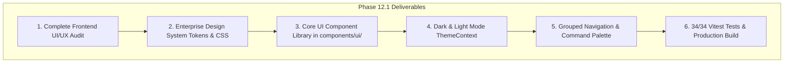

# AegisAI Enterprise — Phase 12.1 Milestone Report: UI/UX Audit & Enterprise Design System

**Project**: AegisAI — Autonomous Multi-Agent System with MCP and Long-Term Memory  
**Milestone**: Phase 12.1 (UI/UX Audit + Enterprise Design System)  
**Status**: **COMPLETE & VERIFIED LOCALLY**  

---

## 1. Milestone Overview

Phase 12.1 establishes the unified enterprise design system and frontend architecture for AegisAI, transforming the interface into a cohesive, high-information-density enterprise AI operating system.

---

## 2. Deliverables Summary

### 1. Centralized Enterprise UI Component Library (`frontend/src/components/ui/`)
- **Buttons**: [`Button.jsx`](file:///d:/CP/AegisAI/frontend/src/components/ui/Button.jsx), [`IconButton.jsx`](file:///d:/CP/AegisAI/frontend/src/components/ui/IconButton.jsx)
- **Badges**: [`Badge.jsx`](file:///d:/CP/AegisAI/frontend/src/components/ui/Badge.jsx), [`StatusBadge.jsx`](file:///d:/CP/AegisAI/frontend/src/components/ui/StatusBadge.jsx)
- **Cards**: [`Card.jsx`](file:///d:/CP/AegisAI/frontend/src/components/ui/Card.jsx), [`MetricCard.jsx`](file:///d:/CP/AegisAI/frontend/src/components/ui/MetricCard.jsx)
- **Form Controls**: [`Input.jsx`](file:///d:/CP/AegisAI/frontend/src/components/ui/Input.jsx), [`Switch.jsx`](file:///d:/CP/AegisAI/frontend/src/components/ui/Switch.jsx)
- **Dialogs & Drawers**: [`Modal.jsx`](file:///d:/CP/AegisAI/frontend/src/components/ui/Modal.jsx), [`Drawer.jsx`](file:///d:/CP/AegisAI/frontend/src/components/ui/Drawer.jsx)
- **Navigation & Layout**: [`Tabs.jsx`](file:///d:/CP/AegisAI/frontend/src/components/ui/Tabs.jsx), [`Breadcrumb.jsx`](file:///d:/CP/AegisAI/frontend/src/components/ui/Breadcrumb.jsx), [`Table.jsx`](file:///d:/CP/AegisAI/frontend/src/components/ui/Table.jsx)
- **State Feedback**: [`EmptyState.jsx`](file:///d:/CP/AegisAI/frontend/src/components/ui/EmptyState.jsx), [`Skeleton.jsx`](file:///d:/CP/AegisAI/frontend/src/components/ui/Skeleton.jsx), [`Timeline.jsx`](file:///d:/CP/AegisAI/frontend/src/components/ui/Timeline.jsx), [`CodeBlock.jsx`](file:///d:/CP/AegisAI/frontend/src/components/ui/CodeBlock.jsx)

### 2. Context Providers
- **[`ThemeContext.jsx`](file:///d:/CP/AegisAI/frontend/src/context/ThemeContext.jsx)**: Persistent dark/light theme switching with zero initial load flash.
- **[`ToastContext.jsx`](file:///d:/CP/AegisAI/frontend/src/context/ToastContext.jsx)**: Accessible notification toast dispatching with auto-dismiss and action handlers.

### 3. Application Shell & Global Command Palette
- Grouped sidebar navigation: **Workspace**, **Knowledge & RAG**, **Ecosystem & Collab**, **Administration**.
- Top navigation with dynamic breadcrumbs, quick search, theme toggle, and node operator telemetry.
- **[`CommandPalette.jsx`](file:///d:/CP/AegisAI/frontend/src/components/CommandPalette.jsx)**: Full keyboard shortcut (`Ctrl+K`) supporting instant navigation, theme toggling, and role-based access filtering.

---

## 3. Verification & Testing Baseline

| Test Suite | Scope | Result | Status |
| :--- | :--- | :--- | :--- |
| **Frontend Vitest Suite** | Design system components, Button/Form states, Modal, Theme, Session, User journeys | **34 / 34 passed** (5 test files) | `VERIFIED LOCALLY` |
| **Frontend Production Build** | Vite production compiler | **2,543 modules transformed**, 0 errors | `VERIFIED LOCALLY` |
| **Backend Regression Suite** | Full backend test suite | **955 / 955 passed** (229 test files) | `VERIFIED LOCALLY` |
| **Visual Browser Automation** | Real browser screenshots / E2E runner | N/A | `NOT BROWSER-VERIFIED` |

---

## 4. Documentation References

- **[`DESIGN-SYSTEM.md`](file:///d:/CP/AegisAI/frontend/docs/DESIGN-SYSTEM.md)**: Design tokens, typography hierarchy, status taxonomy, and component reference.
- **[`UI-UX-AUDIT.md`](file:///d:/CP/AegisAI/frontend/docs/UI-UX-AUDIT.md)**: Comprehensive audit report, consolidation details, and responsive breakdown.
