# AegisAI Enterprise — Phase 12.2 Milestone Report: Intelligence Factory Landing Experience

**Project**: AegisAI — Autonomous Multi-Agent System with MCP and Long-Term Memory  
**Milestone**: Phase 12.2 (Intelligence Factory / Landing Experience)  
**Status**: **COMPLETE & VERIFIED LOCALLY**  

---

## 1. Executive Summary

Phase 12.2 establishes the public-facing **Intelligence Factory** landing experience for AegisAI. The landing page transforms the entry experience into a cinematic, high-density enterprise AI operating system showcase that communicates the end-to-end intelligence assembly pipeline while preserving all existing authenticated routes, tenant isolation, and backend contracts.

```mermaid
flowchart TD
    subgraph Landing Experience Architecture
        Nav[1. Top Sticky Navigation & Theme Controls]
        Hero[2. Cinematic Hero & Blueprint Visualizer]
        Strip[3. Product Capability Strip]
        Pipeline[4. 8-Stage Assembly Line Pipeline]
        Tour[5. 7-Station Interactive Intelligence Tour]
        Arch[6. 4-Tier High-Level Architecture Diagram]
        Security[7. Enterprise Fail-Closed Security Controls]
        UseCases[8. Enterprise Value Solutions]
        Terminal[9. Access Terminal Route Transition]
        Footer[10. Public Footer with Documentation Links]
    end

    Nav --> Hero
    Hero --> Strip
    Strip --> Pipeline
    Pipeline --> Tour
    Tour --> Arch
    Arch --> Security
    Security --> UseCases
    UseCases --> Terminal
    Terminal --> Footer
```

---

## 2. Intelligence Factory Architecture & Stations

### 1. The 8-Stage Assembly Line Pipeline
Every request to the AegisAI Operating System traverses a verified, multi-stage intelligence assembly line:
1. **INPUT**: Secure prompt & payload ingestion with strict schema validation.
2. **UNDERSTAND**: Intent extraction, entity classification, and workspace boundary assignment.
3. **RETRIEVE**: Hybrid vector and knowledge graph lookup with workspace filtering.
4. **REASON**: Multi-agent DAG task decomposition and dependency resolution.
5. **ORCHESTRATE**: Specialized planner, researcher, executor, and critic dispatching.
6. **EXECUTE**: Sandboxed Model Context Protocol (MCP) tool execution.
7. **VERIFY**: Critic evaluation, consensus verification, and citation reconciliation.
8. **RESPOND**: Evidence-backed response delivery with SHA-256 audit chaining.

---

### 2. The 7 Tour Stations Deep-Dive

| Station ID | Title & Subtitle | What It Does | Why It Matters | Execution Flow Sequence |
| :--- | :--- | :--- | :--- | :--- |
| `agents` | **01 — Agent Orchestration** *(Multi-Agent Collective Intelligence)* | Coordinates specialized planner, researcher, executor, critic, and response agents in deterministic DAG workflows. | Breaks complex tasks into verified sub-goals, preventing hallucination through strict verification and consensus. | `User Request` → `Orchestrator` → `Task Planner` → `Specialized Agents` → `Verification Critic` → `Evidence & Response` |
| `memory` | **02 — Long-Term Memory** *(Episodic & Semantic Cognitive Vault)* | Indexes conversational history, agent reflections, and entity profiles into semantic vector memories. | Enables persistent context across sessions while enforcing strict workspace-level tenant isolation. | `Interaction Stream` → `Importance Filter` → `Vector Embedding` → `Memory Vault` → `Semantic Retrieval` → `Execution Context` |
| `knowledge` | **03 — Enterprise Knowledge & RAG** *(Hybrid Vector & Graph Intelligence)* | Extracts documents, computes 1536-dim embeddings, and synthesizes multi-hop Knowledge Graph relationships. | Answers queries with exact citations, physical document reconciliation, and verifiable knowledge provenance. | `Document Ingestion` → `Semantic Chunking` → `Vector Indexing` → `Knowledge Graph Triples` → `Hybrid RAG Search` → `Attributed Evidence` |
| `mcp` | **04 — Model Context Protocol (MCP)** *(Extensible Sandboxed Tool Ecosystem)* | Integrates external tools, databases, APIs, and cloud resources via standardized MCP client-server protocols. | Empowers agents to safely interact with production systems with human-in-the-loop approval gates. | `MCP Discovery` → `Capability Binding` → `Permission Evaluation` → `Sandbox Execution` → `Result Normalization` → `Audit Logging` |
| `workflows` | **05 — Workflow Automation** *(Visual DAG Execution Engine)* | Visual workflow canvas allowing declarative chaining of agents, conditions, loops, and human approvals. | Automates complex business operations deterministically with scheduled triggers and execution replay. | `Workflow Trigger` → `DAG Parser` → `Node Evaluation` → `Approval Checkpoint` → `Worker Execution` → `Persisted Result` |
| `execution` | **06 — Observable Execution** *(Tamper-Evident Lifecycle Tracking)* | Tracks every background job and execution through structured JSON events and cryptographic hash chains. | Provides real-time visibility and post-mortem auditability with zero credential exposure. | `Requested` → `Validating` → `Planned` → `Executing` → `Verifying` → `Completed` |
| `governance` | **07 — Governance & Security** *(Enterprise-Grade Fail-Closed Controls)* | Enforces strict tenant boundaries, role-based access control (RBAC), recursive secret redaction, and SSRF defenses. | Guarantees enterprise data compliance and prevents unauthorized lateral access or prompt injection attacks. | `Identity Verification` → `RBAC Permission Gate` → `SSRF / Injection Filter` → `Secret Redaction` → `SHA-256 Hash Chain` → `Secure Delivery` |

---

### 3. System Architecture & Security Claims Integrity

- **High-Level System Architecture**:
  - **01. INGRESS TIER**: Reverse Proxy with Nginx TLS 1.2/1.3, HSTS, trusted proxies, and rate limiting.
  - **02. COMPUTE TIER**: Stateless Cluster of FastAPI backend replicas & Vite SPA running as non-root UID 10001.
  - **03. DATA TIER**: Durable Persistence via PostgreSQL 16 with advisory locking, Qdrant vectors, and Redis 7.2.
  - **04. ASYNC TIER**: BackgroundJob worker queue with leader election, stale recovery, and dead-lettering.
- **Enterprise Security Controls (Strict Truth-in-Advertising)**:
  - *Strict Tenant Isolation*: Mandatory workspace boundary filtering on every query.
  - *Tamper-Evident Audit Trails*: SHA-256 cryptographic hash chains starting from Genesis.
  - *SSRF & Injection Defenses*: Multi-layer classifiers and private CIDR network egress filtering.
  - **Zero Fabricated Claims**: No fake SOC 2 / ISO certifications, uptime percentages, customer logos, or unverified performance benchmarks.

---

## 3. SEO & Metadata Enhancements

The landing page includes comprehensive search engine optimization and OpenGraph tags in [`frontend/index.html`](file:///d:/CP/AegisAI/frontend/index.html):
- **Page Title**: `AegisAI — Autonomous Multi-Agent Intelligence Platform with Long-Term Memory & MCP`
- **Description**: `Enterprise-grade autonomous multi-agent operating system featuring long-term memory, hybrid knowledge graphs, extensible Model Context Protocol (MCP) tools, and verifiable security controls.`
- **OpenGraph & Twitter Card**: Pre-configured for enterprise social cards and previews.

---

## 4. Verification & Testing Baseline

| Test Suite | Scope | Result | Status |
| :--- | :--- | :--- | :--- |
| **Dedicated Landing Page Tests** | [`landing_factory.test.jsx`](file:///d:/CP/AegisAI/frontend/src/__tests__/landing_factory.test.jsx) (Nav, Auth routing, Hero, Capability strip, 8-stage pipeline, 7 stations, Architecture, Security, Theme toggle) | **16 / 16 passed** | `VERIFIED LOCALLY` |
| **Complete Frontend Vitest Suite** | Design system, session, client, journeys, security, landing page | **50 / 50 passed** (6 test files) | `VERIFIED LOCALLY` |
| **Frontend Production Build** | Vite production compiler | **2,560 modules transformed**, 0 errors | `VERIFIED LOCALLY` |
| **Full Backend Regression Suite** | Unit, integration, security, memory, graph, MCP, CI/CD, staging, DR tests | **955 / 955 passed** (229 test files) | `VERIFIED LOCALLY` |

---

## 5. Verification Limitations

- **Unit & Integration Verification**: **VERIFIED LOCALLY** (100% passing across Vitest and Pytest).
- **Vite Production Bundling**: **VERIFIED LOCALLY** (0 errors).
- **Headless Browser Automated E2E**: **NOT BROWSER-VERIFIED** (In accordance with project guidelines, browser-level visual rendering and screenshot testing was not executed in this environment).
