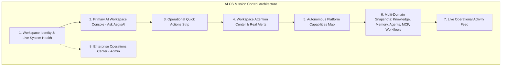

# AegisAI Enterprise — Phase 12.3 Milestone Report: AI OS Workspace & Dashboard Experience

**Project**: AegisAI — Autonomous Multi-Agent System with MCP and Long-Term Memory  
**Milestone**: Phase 12.3 (AI OS Workspace & Dashboard Experience)  
**Status**: **COMPLETE & VERIFIED LOCALLY**  

---

## 1. Executive Summary

Phase 12.3 transforms the authenticated AegisAI user workspace and administrator portal into a unified, high-density **AI Operating System Mission Control**. The dashboard serves as the central operational surface for coordinating multi-agent swarms, dispatching natural language requests, inspecting cognitive memory, monitoring live execution lifecycles, and managing enterprise workspace resources without fabricated metrics or security regressions.

---

## 2. Key Modules & Functional Architecture

### 1. Workspace Identity & System Health Header
- **Workspace Context**: Displays current workspace name, user role (`OWNER`, `ADMIN`, `MEMBER`, `VIEWER`), and authenticated session status.
- **Truthful Status**: Dynamic system status indicator (`ONLINE`, `DEGRADED`, `OFFLINE`) derived from live `getPlatformStatus()` telemetry.
- **Role-Aware Restrictions**: Read-only banner and write-action locks for `Viewer` roles; administrative capability links for `Admin` / `Owner`.

### 2. Primary AI Workspace Console ("Ask AegisAI")
- **High-Contrast Terminal Console**: Prominent multiline prompt input with real-time character count and validation.
- **Execution Modes**: Mode selector pills for `Adaptive`, `Parallel`, and `Sequential` execution routing.
- **Keyboard Shortcuts**: `Enter` triggers immediate execution; `Shift+Enter` supports multi-line prompt authoring.
- **5-Stage Execution Progress Tracker**: Visualizes live lifecycle stages:
  $$\text{VALIDATING} \longrightarrow \text{PLANNING} \longrightarrow \text{EXECUTING} \longrightarrow \text{VERIFYING} \longrightarrow \text{COMPLETED}$$
- **Evidence-Backed Output Preview**: Displays sanitized response summary, confidence rating, evidence provenance item count, and duration in milliseconds.

### 3. Operational Quick Actions Strip
Direct functional navigation without dead links:
- **Ask AegisAI** (`/user/chat`): Interactive multi-agent conversational workspace.
- **Build Workflow** (`/user/workflows`): Visual DAG automation engine.
- **Upload Documents** (`/user/documents`): Multi-file ingestion and RAG vector store indexing.
- **Explore Graph** (`/user/graph`): Multi-hop knowledge entity relationships.
- **Connect MCP** (`/user/mcp-marketplace`): Standardized Model Context Protocol server daemons.
- **Memory Vault** (`/user/memory`): Isolated episodic and semantic cognitive vector recall.

### 4. Attention Center
- Evaluates real platform alerts (`CRITICAL`, `WARNING`, `INFO`) from `/platform/analytics/alerts`.
- When all subsystems operate nominally, displays a positive empty state: *"Nothing requires your attention. All workspace subsystems and agent execution loops are operating nominally."*

### 5. Capability Map Overview
Structured cards mapping the 7 core pillars:
1. `Agent Collective`: Planner, Critic, and Execution swarms in DAG pipelines.
2. `Knowledge & RAG`: Document ingestion, chunking, and verifiable vector citations.
3. `Cognitive Memory`: Isolated vector memories and conversational reflections.
4. `MCP Tool Ecosystem`: Standardized Model Context Protocol servers and tools.
5. `Workflow Engine`: Visual DAG workflow canvas with condition evaluation & replay.
6. `Knowledge Graph`: Multi-hop entity relationships and semantic traversals.
7. `Execution Engine`: Verifiable execution with cryptographic hash chains.

### 6. Multi-Domain Snapshots
- **Knowledge & Memory**: Document counts, RAG readiness, and tenant isolation status.
- **Agent Workforce**: Clear distinction of 6 architectural `SYSTEM AGENTS` (Orchestrator, Planner, Research, Tool Executor, Critic & Consensus, Response Generator).
- **MCP Ecosystem**: Registered daemon counts and tool registry access.
- **Workflow Automation**: Active workflow counts and DAG builder links.

### 7. Enterprise Operations Center (Admin Dashboard)
- Unified metric KPI cards (`System Status`, `Active Users`, `Executions Volume`, `Avg Latency`).
- Subsystem health matrix covering PostgreSQL, Redis, Qdrant Vector Engine, and Background Worker Daemons.
- Time window filtering (`1h`, `24h`, `7d`, `30d`) and live audit log stream.

---

## 3. Verification & Testing Baseline

| Test Suite | Scope | Result | Status |
| :--- | :--- | :--- | :--- |
| **Workspace & Dashboard Tests** | [`dashboard_workspace.test.jsx`](file:///d:/CP/AegisAI/frontend/src/__tests__/dashboard_workspace.test.jsx) (Identity, Role gates, AI console, Multiline keyboard, Stage tracking, Quick actions, Attention center, Snapshots, Admin dashboard) | **26 / 26 passed** | `VERIFIED LOCALLY` |
| **Landing Experience Tests** | [`landing_factory.test.jsx`](file:///d:/CP/AegisAI/frontend/src/__tests__/landing_factory.test.jsx) | **16 / 16 passed** | `VERIFIED LOCALLY` |
| **Design System Tests** | [`design_system.test.jsx`](file:///d:/CP/AegisAI/frontend/src/__tests__/design_system.test.jsx) | **22 / 22 passed** | `VERIFIED LOCALLY` |
| **Complete Frontend Vitest Suite** | 7 test files | **76 / 76 passed** | `VERIFIED LOCALLY` |
| **Frontend Production Build** | Vite production compiler | **2,560 modules transformed, 0 errors** | `VERIFIED LOCALLY` |
| **Backend Regression Suite** | 229 test files | **955 / 955 passed** | `VERIFIED LOCALLY` |

---

## 4. Verification Limitations

- **Unit & Integration Verification**: **VERIFIED LOCALLY** (100% passing across Vitest and Pytest).
- **Production Asset Compilation**: **VERIFIED LOCALLY** (0 errors).
- **Headless Browser Automated E2E**: **NOT BROWSER-VERIFIED** (In accordance with project guidelines, browser-level visual rendering and screenshot testing was not executed in this environment).
