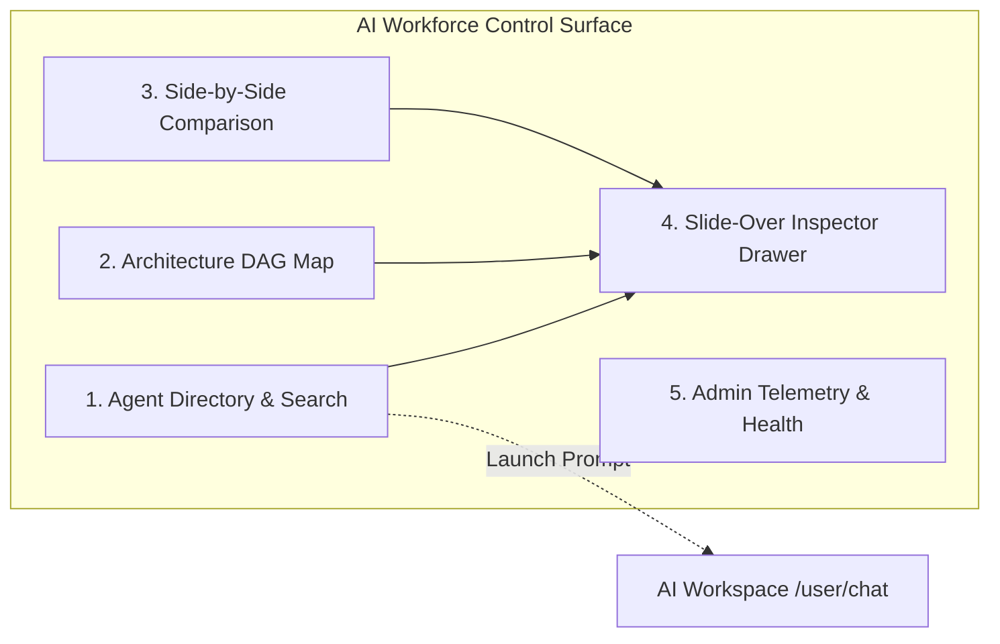

# AegisAI Enterprise — Phase 12.4 Milestone Report: AI Workforce Control Center

**Project**: AegisAI — Autonomous Multi-Agent System with MCP and Long-Term Memory  
**Milestone**: Phase 12.4 (AI Workforce Control Center / Agent Center)  
**Status**: **COMPLETE & VERIFIED LOCALLY**  

---

## 1. Executive Summary

Phase 12.4 transforms the Agent Center (`/user/ai-market` and `/admin/agents`) into a unified, enterprise-grade **AI Workforce Control Center**. Rather than treating agents as a retail app store or consumer novelty, the center accurately represents AegisAI's 9 canonical system agents, DAG coordination topologies, verification handoffs, capability matrices, and enterprise governance boundaries without fabricating metrics, capabilities, or user-created agent models.

---

## 2. Canonical System Agent Taxonomy

AegisAI defines 9 built-in system agents across 4 operational categories:

| Agent Name | Category | Pipeline Stage | Primary Responsibility | Input / Output Contract |
| :--- | :--- | :--- | :--- | :--- |
| **Orchestrator Agent** | `Coordination` | `1. INGEST & DISPATCH` | Task decomposition, execution DAG generation, resource allocation, and swarm handoff. | User Goal $\rightarrow$ Execution DAG |
| **Planner Agent** | `Coordination` | `2. PLAN SYNTHESIS` | Multi-step dependency synthesis, contingency planning, and resource budget calculation. | Task Scope $\rightarrow$ Structured Plan |
| **Research Agent** | `Knowledge & Memory` | `3. INVESTIGATION` | Deep iterative investigation, web exploration, and source corroboration. | Query Intent $\rightarrow$ Research Dossier |
| **Memory Agent** | `Knowledge & Memory` | `3. RECALL & STORE` | Vectorized episodic and semantic memory indexing, conversational recall, and state reflection. | Context Embedding $\rightarrow$ Relevant Memories |
| **Enterprise RAG Agent** | `Knowledge & Memory` | `3. CITATION RETRIEVAL` | Tenant-isolated vector retrieval, hybrid sparse-dense chunk search, and provenance verification. | Semantic Query $\rightarrow$ Grounded Chunks & Citations |
| **Graph Reasoning Agent** | `Knowledge & Memory` | `3. KNOWLEDGE TRAVERSAL` | Multi-hop knowledge graph traversals, entity resolution, and relationship derivation. | Seed Entity $\rightarrow$ Subgraph Traversal Path |
| **Tool Executor Agent** | `Execution & Tools` | `4. TOOL DISPATCH` | Model Context Protocol tool routing, schema-validated execution, and sandbox isolation. | Tool Invocation $\rightarrow$ Tool Output Artifact |
| **Critic & Consensus Agent** | `Verification` | `5. CRITIC EVALUATION` | Multi-perspective consensus validation, hallucination detection, and schema verification. | Intermediate Output $\rightarrow$ Verification Scorecard |
| **Response Generator Agent** | `Coordination` | `6. FINAL SYNTHESIS` | Evidence consolidation, user persona alignment, citation formatting, and safe delivery. | Verified Evidence $\rightarrow$ Final Structured Response |

---

## 3. Key Modules & Functional Architecture

### 1. Workforce Header & Multi-View Switcher
- **View Modes**: Supports 3 seamless views: `Directory` (grid layout), `Architecture Map` (visual DAG and screen-reader accessible flow), and `Comparison` (side-by-side agent evaluator).
- **KPI Telemetry Strip**: Displays live workforce status:
  - System Workforce: `9 Active Canonical Agents`
  - Swarm Topology: `Dynamic DAG / Parallel`
  - Verification Gate: `Critic Consensus Enforced`
  - Security Boundary: `Strict Tenant Isolation`

### 2. Search & Category Filter System
- **Debounced Text Search**: Searches across agent name, role, description, and capability tags.
- **Category Filter Pills**: Filter by `All`, `Coordination`, `Knowledge & Memory`, `Execution & Tools`, and `Verification`.
- **Empty State**: Clear fallback with reset action when search returns no matches.

### 3. Deep Agent Inspector Drawer
- Built using the enterprise `Drawer` component (`aria-modal="true"`, focus trap, escape key closing).
- Inspects granular system agent details:
  - **Operational Purpose & Pipeline Stage**
  - **Execution Dependencies**: Explicit upstream input handoffs and downstream consumer agents.
  - **Capability Permissions Matrix**: Read / Write / Execute privileges across Memory, RAG, MCP Tools, KG Graph, and Execution Engine.
  - **Connected Subsystems**: PostgreSQL, Redis, Qdrant Vector DB, MCP Daemon, and LLM Gateway.
  - **Governance & Security Controls**: Tenant isolation level, PII masking, cryptographic verification checks, and prompt-injection defenses.
  - **Evidence Output Contract**: Specification of structured output schemas and verifiable citations.
  - **Direct Workspace Transition**: "Use in Workspace" CTA routes directly to `/user/chat` pre-seeded with context.

### 4. Interactive Architecture Flow Map
- Visualizes the complete DAG execution pipeline from User Input to Final Output.
- Displays node stages with category badges and active hover states.
- **Accessibility (a11y)**: Includes an accessible plain-text numbered list with complete screen reader annotations for full WCAG compliance.

### 5. Side-by-Side Agent Comparison View
- Allows selecting any two system agents to compare:
  - Roles & Pipeline Stages
  - Subsystem Access & Tool Registries
  - Input & Output Schemas
  - Tenant Isolation & Governance Boundaries
  - Swarm Handoff Dependencies

### 6. Admin Agent Operations Surface
- Synchronized with Phase 12 enterprise design system.
- Displays agent system health, active execution loops, and subsystem telemetry.

---

## 4. Verification & Testing Baseline

| Test Suite | Scope | Result | Status |
| :--- | :--- | :--- | :--- |
| **Agent Center Tests** | [`agent_center.test.jsx`](file:///d:/CP/AegisAI/frontend/src/__tests__/agent_center.test.jsx) (Directory rendering, Search filtering, Category filtering, Inspector Drawer opening/closing, Architecture Map view & accessible list, Comparison view selector, Workspace navigation CTA, Admin agents view) | **17 / 17 passed** | `VERIFIED LOCALLY` |
| **Workspace & Dashboard Tests** | [`dashboard_workspace.test.jsx`](file:///d:/CP/AegisAI/frontend/src/__tests__/dashboard_workspace.test.jsx) | **26 / 26 passed** | `VERIFIED LOCALLY` |
| **Landing Experience Tests** | [`landing_factory.test.jsx`](file:///d:/CP/AegisAI/frontend/src/__tests__/landing_factory.test.jsx) | **16 / 16 passed** | `VERIFIED LOCALLY` |
| **Design System Tests** | [`design_system.test.jsx`](file:///d:/CP/AegisAI/frontend/src/__tests__/design_system.test.jsx) | **22 / 22 passed** | `VERIFIED LOCALLY` |
| **Complete Frontend Vitest Suite** | 8 test files | **93 / 93 passed** | `VERIFIED LOCALLY` |
| **Frontend Production Build** | Vite production compiler | **2,560 modules transformed, 0 errors** | `VERIFIED LOCALLY` |
| **Backend Regression Suite** | 229 test files | **955 / 955 passed** | `VERIFIED LOCALLY` |

---

## 5. Verification Limitations

- **Unit & Integration Verification**: **VERIFIED LOCALLY** (100% passing across Vitest and Pytest suites).
- **Production Asset Compilation**: **VERIFIED LOCALLY** (0 errors).
- **Headless Browser Automated E2E**: **NOT BROWSER-VERIFIED** (In accordance with project guidelines, browser-level visual rendering and screenshot testing was not executed in this environment).
