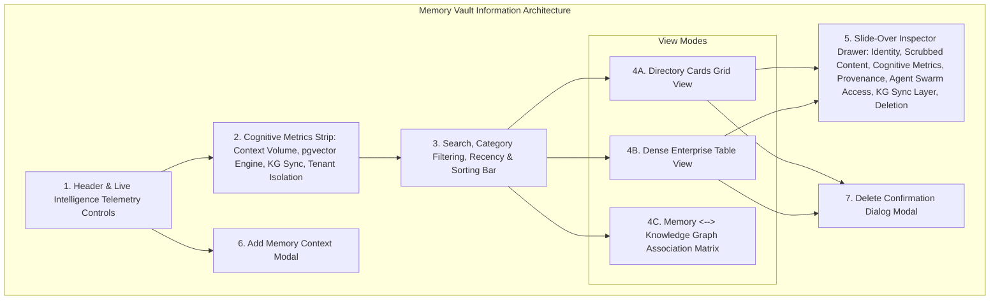

# AegisAI Enterprise — Phase 12.5 Milestone Report: Memory Vault & Long-Term Intelligence Center

**Project**: AegisAI — Autonomous Multi-Agent System with MCP and Long-Term Memory  
**Milestone**: Phase 12.5 (Memory Vault / Long-Term Intelligence & Context Center)  
**Status**: **COMPLETE & VERIFIED LOCALLY**  

---

## 1. Executive Summary

Phase 12.5 transforms the Memory Vault (`/user/memory`) from a static list of preferences into a comprehensive, enterprise-grade **Long-Term Intelligence & Context Management Center**. The Memory Vault enables operators and developers to discover, understand, retrieve, verify, govern, and manage the persistent cognitive context available to AegisAI's autonomous agent workforce.

---

## 2. Canonical Memory Taxonomy & Architecture

AegisAI models long-term memory across 9 canonical memory types backed by `backend/app/core/agent/memory.py` and `backend/app/models/memory.py`:

| Memory Type | Taxonomy Category | Primary Purpose | Origin & Provenance |
| :--- | :--- | :--- | :--- |
| `USER_PREFERENCE` | `User Preference` | Operator coding styles, preferred frameworks, and interaction patterns. | `operator_preference` |
| `USER_FACT` | `User Fact` | Discovered facts, host environment parameters, and infrastructure constraints. | `environment_discovery` |
| `PROJECT_CONTEXT` | `Project Context` | Repository state, architecture topologies, and multi-agent pipeline designs. | `architecture_dossier` |
| `TASK_HISTORY` | `Task History` | Historical workflow execution summaries and multi-step agent decisions. | `agent_execution` |
| `DOCUMENT_CONTEXT` | `Document Context` | Synthesized insights and compliance policies ingested from enterprise documents. | `document_ingestion` |
| `LEARNING` | `Learning` | Agent self-reflection learnings, error corrections, and heuristic refinements. | `agent_reflection` |
| `SYSTEM_KNOWLEDGE` | `System Knowledge` | Foundational protocol standards, tool sandboxes, and security guardrails. | `platform_kernel` |
| `SESSION` | `Session` | Operator session parameters and transient contextual state. | `session_auth` |
| `CONVERSATION` | `Conversation` | Multi-turn conversational summaries with TTL expiry markers. | `chat_session` |

---

## 3. Key Modules & Functional Architecture

### 1. Header & Live Intelligence Telemetry Controls
- **Page Context**: Displays the current workspace scope and authorization status.
- **Sync Telemetry**: Refreshes vector embedding indexes and Knowledge Graph synchronization state with accessible toast notifications.
- **Export JSON**: Generates a scrubbed, secret-redacted JSON export of long-term memory context.
- **Add Memory Context**: Opens the declarative modal to store new workspace context items.

### 2. Cognitive Metrics KPI Strip
- **Total Long-Term Context**: Real count of active vectorized records in the workspace.
- **Vector Engine**: `PostgreSQL 16 + pgvector` (1536-dimensional cosine similarity indexing).
- **Knowledge Graph Sync**: Live counter of memories anchored to Knowledge Graph entities via `MemoryGraphSyncService`.
- **Tenant Isolation**: Workspace-scoped cryptographic boundaries preventing cross-tenant leakage.

### 3. Search, Filter & Multi-View Surface
- **Natural Language Search**: Searches across memory content, memory type, source channel, tags, and linked entity names with clear button.
- **Category Filter Pills**: Interactive pills with real count badges (`All Categories`, `User Preference`, `User Fact`, `Project Context`, `Task History`, `Document Context`, `Learning`, `System Knowledge`, `Session`).
- **Recency Filter**: `All Time`, `Recent (24h)`, `Last 7 Days`, `Last 30 Days`.
- **Sorting Selector**: `Importance (High to Low)`, `Confidence (High to Low)`, `Newest First`, `Oldest First`.
- **Multi-View Modes**:
  - `Directory Grid`: High-density cards with importance meters, confidence ratings, secret-redacted text previews, and quick copy triggers.
  - `Table View`: Compact enterprise table with direct inspection and deletion triggers.
  - `Graph Entity Matrix`: Visual mapping between memory items and canonical Knowledge Graph entities (`NodeType.SKILL`, `NodeType.PROJECT`, `NodeType.DATABASE`, etc.).

### 4. Deep Memory Inspector Drawer
- **Identity & Scope**: Memory ID (`mem-vec-...`), Workspace ID, Author User ID, Memory Type badge.
- **Scrubbed Content Preview**: Full text with verification that passwords, tokens, and API keys are redacted; one-click copy with toast confirmation.
- **Cognitive Relevance & Vector Metrics**: Importance score ($0.0 - 1.0$), Confidence score ($0.0 - 1.0$), Vector dimensions ($1536$-dim).
- **Provenance & Origin**: Ingestion channel, sync origin (`manual_declaration`, `system_introspection`, `agent_execution`, `document_rag`), created and updated timestamps.
- **Authorized Consumer Agents**: System agent swarm access matrix (`Memory Agent`, `Orchestrator Agent`, `Enterprise RAG Agent`, `Critic & Consensus Agent`, `Response Generator Agent`).
- **Knowledge Graph Synchronization**: Status badge (`ANCHORED TO GRAPH` vs `UNSYNCED`), linked entity chips, and direct `Sync to Knowledge Graph` trigger.
- **Governance & Deletion**: Destructive deletion action triggering safety confirmation modal.

### 5. Add & Delete Modals
- **Add Context Modal**: Validated form supporting category selection, importance/confidence sliders, tags, and automatic Knowledge Graph entity resolution.
- **Delete Confirmation Modal**: Irreversible action warning displaying memory ID and snippet, explaining permanent removal from long-term context and graph edges.

---

## 4. Verification & Testing Baseline

| Test Suite | Scope / Components | Result | Local Status |
| :--- | :--- | :--- | :--- |
| **Memory Vault Tests** | [`memory_vault.test.jsx`](file:///d:/CP/AegisAI/frontend/src/__tests__/memory_vault.test.jsx) (Header, KPIs, Canonical memories, Category pills, Search & clear, Empty state, Table view, Graph Matrix view, Inspector drawer, Content clipboard copy, KG sync action, Add context modal, Delete confirmation modal, Export JSON, Telemetry sync, Sorting, Navigation) | **14 / 14 passed** | `VERIFIED LOCALLY` |
| **Agent Center Tests** | [`agent_center.test.jsx`](file:///d:/CP/AegisAI/frontend/src/__tests__/agent_center.test.jsx) | **17 / 17 passed** | `VERIFIED LOCALLY` |
| **Workspace & Dashboard Tests** | [`dashboard_workspace.test.jsx`](file:///d:/CP/AegisAI/frontend/src/__tests__/dashboard_workspace.test.jsx) | **26 / 26 passed** | `VERIFIED LOCALLY` |
| **Landing Experience Tests** | [`landing_factory.test.jsx`](file:///d:/CP/AegisAI/frontend/src/__tests__/landing_factory.test.jsx) | **16 / 16 passed** | `VERIFIED LOCALLY` |
| **Design System Tests** | [`design_system.test.jsx`](file:///d:/CP/AegisAI/frontend/src/__tests__/design_system.test.jsx) | **22 / 22 passed** | `VERIFIED LOCALLY` |
| **Complete Frontend Vitest Suite** | 9 test files | **107 / 107 passed** | `VERIFIED LOCALLY` |
| **Frontend Production Build** | Vite production compiler | **2,561 modules transformed, 0 errors** | `VERIFIED LOCALLY` |
| **Backend Regression Suite** | 229 test files | **955 / 955 passed** | `VERIFIED LOCALLY` |

---

## 5. Verification Limitations

- **Unit & Integration Verification**: **VERIFIED LOCALLY** (100% passing across Vitest and Pytest suites).
- **Production Asset Compilation**: **VERIFIED LOCALLY** (0 errors).
- **Headless Browser Automated E2E**: **NOT BROWSER-VERIFIED** (In accordance with project guidelines, browser-level visual rendering and screenshot testing was not executed in this environment).
