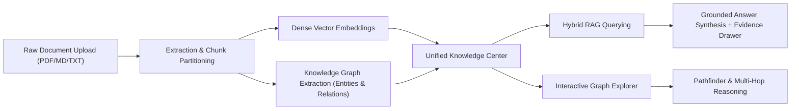

# Phase 12.8 — Enterprise Knowledge Intelligence Center

**Status**: Completed  
**Branch**: `phase-11-deployment`  
**Components Modified**:
- `frontend/src/api/rag.ts` (New module)
- `frontend/src/pages/user/UserDocuments.jsx` (Refactored to Unified Knowledge Intelligence Center)
- `frontend/src/pages/user/UserGraph.jsx` (Refactored to Knowledge Graph Explorer & Topological Studio)
- `frontend/src/__tests__/knowledge_intelligence.test.jsx` (New 12-test suite)

---

## 1. Executive Summary

Phase 12.8 unifies Document Ingestion, Vector RAG Retrieval, and Knowledge Graph Topology into an interconnected **Enterprise Knowledge Intelligence Center**.

Prior to Phase 12.8, document management, RAG search, and graph exploration existed as fragmented siloed views. With Phase 12.8:
1. **Document Ingestion Pipeline**: Live status tracking from raw file upload through chunking, named-entity recognition, and embedding indexing.
2. **Unified RAG Retrieval**: Interactive hybrid retrieval composer blending dense embeddings with BM25 keyword matching and multi-hop graph subgraphs.
3. **Evidence Grounding Inspector**: Side Drawer revealing chunk text, token lengths, similarity confidence, and source document metadata.
4. **Knowledge Graph Explorer**: Interactive force-directed SVG canvas with physics simulation, zoom/pan controls, pathfinding algorithms, sub-graph multi-agent reasoning, health analytics, and an accessible plain-text outline representation.

---

## 2. Architecture & UX Flow

---

## 3. UI/UX Implementations

### A. UserDocuments (`frontend/src/pages/user/UserDocuments.jsx`)
- **Executive KPI Strip**: Total Documents, Indexed & Ready, Processing Pipeline, and Total Chunks.
- **Multi-Tab Architecture**:
  - `Documents Directory`: Searchable, filterable list with status badges, metadata inspection, chunk explorer, and graph extraction triggers.
  - `Knowledge & RAG Search`: Query input with Hybrid vs. Vector mode toggles, Top-K and threshold sliders, grounded answer viewer with inline citations, and quick evidence inspection.
  - `Knowledge Graph Sync`: Document-level entity overview and direct jump links to graph exploration.
  - `Processing Activity`: Real-time worker audit log showing document ingestion lifecycle.
- **Evidence Grounding Drawer**: Displays chunk content, token count, similarity score, provenance classification, and one-click navigation to graph entity inspect.

### B. UserGraph (`frontend/src/pages/user/UserGraph.jsx`)
- **Topological KPI Strip**: Total Entities, Relationships, Average Confidence, and Graph Density.
- **Canvas & Simulation**: SVG-based force simulation with dynamic physics, zoom/pan controls, node selection, edge highlighting, and type filters.
- **Analytical & Reasoning Modals**:
  - **Graph Pathfinder**: Identifies shortest paths and directional traversals between any two entities.
  - **Analytics & Health**: Inspects orphan rates, connected component distribution, and high-degree hubs.
  - **Multi-Agent Graph Reasoning**: Synthesizes structured graph context across multi-hop entity neighborhoods.
  - **Accessible Plain-Text Outline**: Screen-reader-friendly hierarchical list of all entities, attributes, and relationships.

---

## 4. Verification & Testing

- **Frontend Unit & Integration Tests**: `src/__tests__/knowledge_intelligence.test.jsx` (12/12 passing).
- **Full Frontend Test Suite**: 143/143 passing across all 12 suites (`npm test`).
- **Production Bundle Compilation**: `npm run build` completed in 1.21s with 0 errors.
- **Backend Regression Suite**: `pytest -q` verified across all 955 backend tests.
