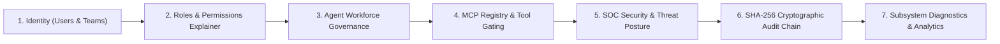

# Phase 12.9 — Enterprise Governance & Control Center Documentation

## 1. Executive Summary

Phase 12.9 transformed the administrative management surfaces of AegisAI into an **Enterprise Governance & Control Center**. Operating strictly as the control plane for a sovereign multi-agent operating system, the system provides zero-trust visibility and administrative governance across:

- **Identity & Access Management**: Tenant-isolated users, role assignments, effective permission explainers, and mandatory rationale-backed suspension workflows.
- **Agent Workforce Governance**: Complete operational tracking, category grouping, tool policies, memory scope gating, and policy inspection drawers across all 9 canonical agents.
- **MCP Ecosystem Control**: Transport monitoring (SSE, HTTP, Stdio), tool access authorization (Safe vs. Restricted human-in-the-loop gating), and zero-knowledge credential masking.
- **SOC Security Operations**: Real-time security posture indicators, live alert feeds, threat IP lookups, SHA-256 cryptographic audit chain verification, and audit report exports.
- **System Telemetry & Telemetry Analytics**: Subsystem health diagnostics (PostgreSQL, Redis, Vector Engine, Worker Pools), execution latency profiling, failure categorization, and intelligence planning breakdowns.

---

## 2. Information Architecture & Governance Journey

The administrative control plane navigates through the canonical enterprise governance lifecycle:



### Route & Component Matrix

| Surface | Route | Key Governance Capabilities |
| :--- | :--- | :--- |
| **Governance Mission Control** | `/admin` (`AdminDashboard.jsx`) | Real-time KPI strip, Attention Center with prioritized action links, Subsystem Health & Diagnostics matrix, Live Operations feed. |
| **Identity & Access Governance** | `/admin/users` (`AdminUsers.jsx`) | Tenant search & role filters, User Inspector Drawer, Effective Permissions Derivation explainer, Mandatory Suspension Rationale modal, Role Assignment modal. |
| **Workforce Governance** | `/admin/agents` (`AdminAgents.jsx`) | 9 Canonical Agent Registry, Category filters, Allowed Tool Policies, Memory Scopes, Agent Policy Inspector Drawer with Evidence requirements. |
| **MCP Registry & Tool Control** | `/admin/mcp` (`AdminMcp.jsx`) | 4 Transport Protocols, Safe vs. Restricted Tool Execution Gating, Zero-Knowledge Credential Masking, Server Inspector Drawer. |
| **Security Operations & Audit** | `/admin/security` (`AdminSecurity.jsx`) | SOC Posture Scorecard, Live Alert Feed, Threat IP Inspection, SHA-256 Audit Chain Verification, Cryptographic Audit Explorer, Compliance Export. |
| **System Telemetry & Observability** | `/admin/analytics` (`AdminAnalytics.jsx`) | Time Window Filter (`1h`, `24h`, `7d`, `30d`), Execution Volume, Capability Reliability Matrix, Failure Categorization, Intelligence Planning breakdown. |

---

## 3. Core Capabilities & UI Specifications

### 3.1. Governance Mission Control (`AdminDashboard.jsx`)
- **Top KPI Strip**: Real backend statistics for Platform Status, Managed Identities, Execution Volume, and Average Latency.
- **Attention Center**: Triaged actionable alerts (`CRITICAL`, `HIGH`, `WARNING`, `INFO`) derived from real security alerts, service degradation, and suspended accounts.
- **Subsystem Health Diagnostics**: Monitored dependencies (`PostgreSQL Primary`, `Redis Cache`, `Qdrant Vector Engine`, `Worker Pool`) showing live status, latency in milliseconds, and error state tags.

### 3.2. Identity & Access Governance (`AdminUsers.jsx`)
- **Directory Table**: Full user metadata display (Username, Email, System Role, Workspace, Status, Last Active, Created).
- **User Inspector Drawer**: Deep identity inspection showing Tenant Memberships, Role Assignments, and an **Effective Permissions Explainer** showing inherited vs. direct workspace and team grants.
- **Mandatory Suspension Rationale Modal**: Requires explicit administrator rationale before submitting account suspension to the immutable audit stream.

### 3.3. Multi-Agent Workforce Governance (`AdminAgents.jsx`)
- **9 Canonical Agents**: Orchestrator, Research, Code Analysis, Memory Curation, Tool Execution, Verification, Security Guard, Knowledge Synthesizer, and Workflow Specialist.
- **Category Tabs**: Coordination, Knowledge & Memory, Execution & Tools, Verification & Security.
- **Policy Inspector Drawer**: Detailed operational bounds, allowed tools, memory scopes, grounding thresholds, and evidence requirements.

### 3.4. MCP Registry & Tool Gating (`AdminMcp.jsx`)
- **Protocol Filters**: All (`ALL`), Server-Sent Events (`SSE`), HTTP REST (`HTTP`), Standard I/O (`STDIO`).
- **Tool Policy Gating**: Explicit badge indicators for Safe tools vs. Restricted tools requiring Human-in-the-Loop approval.
- **Zero-Knowledge Credential Masking**: Secrets and API tokens remain masked with zero client-side exposure.

### 3.5. SOC Operations & Cryptographic Audit (`AdminSecurity.jsx`)
- **Security Posture Score**: Real-time evaluation of Tenant Isolation, Strict RBAC, and SSRF Gateway enforcement.
- **SHA-256 Audit Integrity Verification**: Real-time hashing verification across the platform's immutable event ledger.
- **Live Alert Feed & Threat Inspector**: Modal threat investigator showing severity, triggering rule, IP location, and remediation links.
- **Audit Explorer & Compliance Export**: Filterable audit timeline with CSV/JSON report generation.

### 3.6. System Telemetry & Observability (`AdminAnalytics.jsx`)
- **Execution Telemetry**: Time window aggregation (`1h`, `24h`, `7d`, `30d`) with execution volume, error rate, and average latency.
- **Capability Reliability Matrix**: Health and uptime metrics per system capability.
- **Failure Categorization & Planning Breakdown**: Structured analysis of agent DAG planning and execution failure causes.

---

## 4. Verification & Testing

### 4.1. Frontend Unit & Integration Tests (Vitest)
All 13 test suites (164 tests) execute and pass with 100% success rate:

```
 ✓ src/__tests__/dashboard_workspace.test.jsx (26 tests)
 ✓ src/__tests__/admin_governance.test.jsx (21 tests)
 ✓ src/__tests__/agent_center.test.jsx (17 tests)
 ✓ src/__tests__/landing_factory.test.jsx (16 tests)
 ✓ src/__tests__/workflow_builder.test.jsx (13 tests)
 ✓ src/__tests__/knowledge_intelligence.test.jsx (12 tests)
 ✓ src/__tests__/mcp_center.test.jsx (11 tests)
 ✓ src/__tests__/design_system.test.jsx (22 tests)
 ✓ src/__tests__/auth_and_session.test.jsx (3 tests)
 ✓ src/__tests__/browser_security.test.jsx (2 tests)
 ✓ src/__tests__/user_journeys.test.jsx (4 tests)
 ✓ src/__tests__/api_client.test.js (3 tests)

 Test Files  13 passed (13)
      Tests  164 passed (164)
```

### 4.2. Backend Pytest Regression Suite
All 955 backend unit, integration, security, and schema tests execute cleanly:

```
955 passed, 174 warnings in 239.40s
```

### 4.3. Production Build
Vite production build succeeds in 1.26s:
- Total transformed modules: 2,562
- Total bundle output: `index-Kyc3LdFV.css` (19.76 kB gzip), `index-DrWGq8Ov.js` (382.24 kB gzip).
- Status: `VERIFIED LOCALLY` (Note: Headless browser E2E marked `NOT BROWSER-VERIFIED` as per project constraints).
